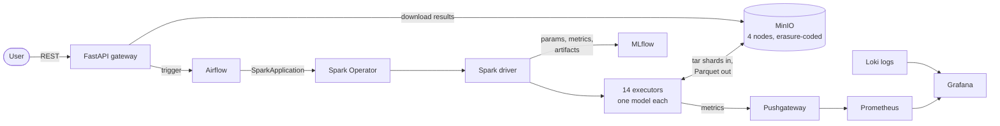
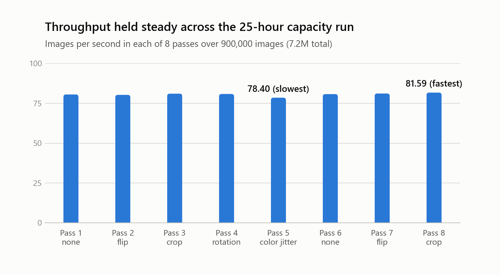
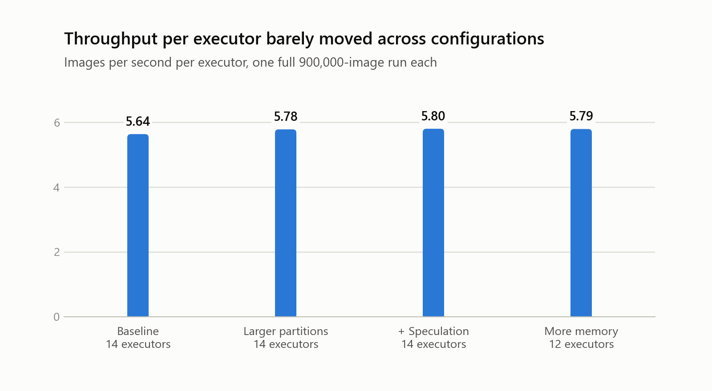
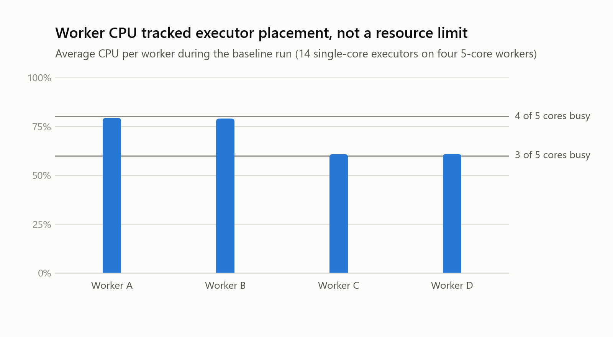

# Distributed ML Inference Platform: Case Study

I designed and built a platform that runs ResNet-50 image classification over
ImageNet across a five-node, CPU-only Kubernetes cluster. It covers everything
from provisioning the VMs to a REST API that lets someone submit images and
download predictions without touching Kubernetes or Spark. This write-up covers
the design, the results, and what the measurements actually showed.

**Headline:** a 25-hour unattended run processed **7.2 million images** at a
sustained **79.6 images/second**, with no failed passes and no slowdown over
time.

> The source code is private. It is available to reviewers on request.

---

## What it does

1. A user submits a job through a REST API: either a path to data already in
   object storage, or a batch of uploaded images.
2. The API triggers a workflow that launches a distributed Spark job on
   Kubernetes.
3. Spark executors read images from distributed object storage in large tar
   shards, batch them through ResNet-50, and write top-5 predictions as Parquet.
4. The run's parameters, statistics and artifacts go to an experiment tracker;
   live throughput and hardware metrics go to dashboards.
5. The user polls for status and downloads the results through the same API.

## Architecture

**Cluster:** one small control node (2 vCPU, 20 GB) running orchestration and
observability, and four workers (5 vCPU, 30 GB each) running inference and
storage. The control node is deliberately lean: its services mostly wait on
requests and scrape intervals, so the cores go to the workers.

| Layer | Technology |
|---|---|
| Infrastructure as code | Terraform for VMs, Ansible for node setup, K3s |
| Storage | MinIO across 4 nodes with erasure coding (tolerates a node loss) |
| Compute | Apache Spark 3.5 on Kubernetes via the Spark Operator; PyTorch on CPU |
| Orchestration | Apache Airflow with the Kubernetes executor |
| Experiment tracking | MLflow (PostgreSQL metadata, MinIO artifacts) |
| Serving | FastAPI: submit, status, and results download |
| Observability | Prometheus, Pushgateway, Grafana, Loki |
| Security | Default-deny network policies per namespace, least-privilege RBAC, resource quotas |
| CI | GitHub Actions: lint, tests, image builds to GHCR |

## Key design decisions

**Spark on Kubernetes rather than Ray, Dask or a task queue.** Spark recovers a
lost executor's work by recomputing only the affected partitions (RDD lineage),
which matters for a run lasting more than a day. The Spark Operator lets a job
be declared as a Kubernetes resource, so the workflow engine submits a
manifest instead of managing Spark processes itself.

**Load the model once per executor, not once per image.** Inference runs
per partition, with the model cached in each executor process, so 900,000
images meant roughly one model load per executor rather than one per image.

**Tar shards instead of individual JPEGs.** 900 shards of 1,000 images turn
hundreds of thousands of small object reads into 900 large sequential ones.
Each shard maps to one Spark partition.

**Distributed object storage, after a mid-project rebuild.** The first design
put all 140 GB of data on the control node. That filled its disk and made
storage a single point of failure, so I replaced it with a four-node MinIO
deployment and rewrote ingest as a parallel Kubernetes Job that streams the
dataset straight into storage. No node ever holds the full dataset.

**Single-core executors.** Two-core executors ran two inference tasks in one
container and hit memory-pressure evictions. With one core, each executor runs
one task with one model, so memory is predictable, and 14 of them fit the
namespace quota with headroom.

**Security by default.** Every namespace denies inbound traffic unless a policy
allows it, and each allowed path is listed explicitly: object storage, for
example, accepts traffic only from the handful of workloads that use it. No
credentials live in the repository.

## Results

Each configuration processed the same 900,000 images once.

| Configuration | Executors | Images/sec | Per executor |
|---|---:|---:|---:|
| Baseline | 14 | 78.91 | 5.64 |
| Larger input partitions | 14 | 80.95 | 5.78 |
| + Speculative execution | 14 | 81.22 | 5.80 |
| More memory per executor | 12 | 69.52 | 5.79 |
| 25-hour run (8 passes) | 14 | 79.60 | 5.69 |

<picture>
  <source media="(prefers-color-scheme: dark)" srcset="assets/capacity-passes-dark.png">
  
</picture>

Throughput stayed within about 4% across all eight passes. The slowest pass
used the most expensive preprocessing (colour jitter), and the last pass was
the fastest, so there was no sign of memory leaks, storage degradation or
gradual slowdown.

## What the measurements actually showed

I originally expected storage I/O to be the bottleneck and tuned for it. When I
went back over the data, the picture was different.

<picture>
  <source media="(prefers-color-scheme: dark)" srcset="assets/per-executor-throughput-dark.png">
  
</picture>

**Throughput scaled with the number of executors and almost nothing else.**
Each executor processed about 5.7 images/second in every configuration. The
"more memory" round dropped from 14 to 12 executors to fit its larger
allocation, and lost almost exactly two executors' worth of throughput
(81.22 × 12⁄14 = 69.6 predicted, 69.52 measured).

<picture>
  <source media="(prefers-color-scheme: dark)" srcset="assets/worker-cpu-dark.png">
  
</picture>

**The CPU numbers say the same thing.** Fourteen single-core executors on four
five-core workers land 4, 4, 3 and 3 per node, which is 80% and 60% CPU. That
is what the workers showed, while disk reads averaged under 2 MB/s. The
workload was bound by executor slots, and about 5 of the 20 worker cores ran
no executor.

**The tuning results needed a second look.** The partition-size change
probably did not change partitioning at all: shards are never split and each
is larger than both settings, so the source of its 2.6% gain is unclear.
Speculative execution added 0.3%, inside the roughly 1% spread between
identical passes. The lever that would have mattered is more executors, which
means shrinking each executor's memory footprint and raising the CPU quota.

**The monitoring had a bug that hid this.** Every executor pushed metrics to
the same Pushgateway group, and each push replaced the previous one, so the
live throughput graph substantially under-reported. The headline numbers
were always taken from wall-clock time and the experiment tracker, so they are
unaffected. The fix was a per-executor grouping key.

## Fault tolerance

| Failure | What happens |
|---|---|
| Executor lost | The driver requests a replacement pod and re-runs only the lost partitions |
| Whole Spark job fails | The Spark Operator resubmits it (up to 2 retries) |
| One storage node down | Reads and writes continue; with two down, data stays readable |
| Worker node lost | Kubernetes evicts and reschedules its pods; the job restarts rather than failing |
| Workflow task fails | Airflow retries it |

The control node is a single point of failure: it hosts the workflow engine,
tracking server, database and API. That was an accepted trade-off at this
scale. In production I would separate the control plane and use managed
metadata stores.

## Lessons

- **Measure the bottleneck before tuning.** I spent optimisation rounds on
  I/O-oriented settings when per-executor throughput and CPU placement already
  pointed at executor count. Normalising results per worker unit would have
  shown this on day one.
- **Check the monitoring as well as the system.** A metrics pipeline can be
  quietly wrong. Cross-checking live metrics against an independent source
  (wall-clock totals) is what exposed the Pushgateway overwrites.
- **Integration failures are the real work.** The 24-hour workflow failed four
  times before it ran cleanly: worker pods not inheriting environment and
  secrets, pods scheduled in the wrong namespace, network-policy labels left
  stale by the storage migration, and a mismatch between two S3 client
  libraries. Each was diagnosed from task logs and cluster state, and I kept a
  script-based fallback so the long run was never blocked on them.
- **Report negative results.** The memory-tuning round made things worse, and
  it turned out to be the clearest evidence of what actually limited the
  system.

## What I would do next

- Run more, smaller executors (trimming the JVM heap, which inference barely
  uses) and use the idle cores.
- Repeat each configuration several times to separate real effects from noise.
- Move the control-plane services off a single node.
- Add a small local profile so the platform can be tried without a cluster.
